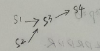

1. 什么是前趋图？为什么要引入前趋图？
> &emsp;&emsp;前驱图是一个带权的有向无环图DAG，用以描述进程间的执行的先后顺序

2. 试画出下面四条语句的前趋图：  
S1: a=x+y;  
S2: b=z+l;  
S3: c=a-b;  
S4: w=c+l;  
> &emsp;&emsp;

3. 为什么程序并发执行会产生间断性特征？
> &emsp;&emsp;由于程序之间**共享系统资源**，以及为了完成同一项任务而**相互合作**，导致这些并发执行的程序形成了**相互制约**的关系

4. 程序并发执行时为什么会失去封闭性和可再现性？
> &emsp;&emsp;封闭性指的是在顺序执行时，程序**独占全机资源**，除资源的初始状态外，资源的状态**只会**被该程序改变  
> &emsp;&emsp;而并发执行时，因为程序之间共享系统资源，这导致资源的状态变化不仅仅会被本程序所修改，还会被其他程序修改，因此失去了封闭性  
> &emsp;&emsp;可再现性指的是顺序执行时，只要执行时的环境和初始条件相同，其结果就是一样的  
> &emsp;&emsp;而并发执行中，因为**失去了封闭性**，无法再现初始条件时的场景，所以失去了再现性  

5. 在操作系统中为什么要引入进程的概念？它会产生什么样的影响？
> &emsp;&emsp;按照书本里的说明，是因为为了在多道系统中，能够使程序并发执行，并对并发执行的程序加以控制，引入了进程的概念  
> &emsp;&emsp;本人复习这里的时候觉得既然进程能够并发执行，那么程序本身应该也可以并发执行，换言之可以直接使用程序而不是进程  
> &emsp;&emsp;但是查询资料后发现，这种想法是**错误**的  
> &emsp;&emsp;理解如下：  
> &emsp;&emsp;&emsp;1. 程序原本是存储在磁盘上的一段程序，通常是文件形式，在需要执行时由CPU从磁盘调入内存执行，但是程序的执行不仅仅需要代码本身，通常还配合数据，这些数据往往体现在各个寄存器，程序计数器等等上。如果以程序本身去进行并发，**程序本身时没有办法暂存这些寄存器内容**，而这些存储数据的组件的内容，会被其他程序修改，因此没有办法直接并行程序。  
> &emsp;&emsp;&emsp;2. 引入进程后，通过进程控制块控制和管理进程，使得程序段(以及数据段)可以**独立**运行，以便实现并发执行

6. 试从动态性、并发性和独立性上比较进程和程序。
> &emsp;&emsp;1. 动态性  
> &emsp;&emsp;&emsp;进程表示的是一个执行过程(进程实体的执行过程)，因此具有动态性；而程序是一组有序指令的集合，静态的  
> &emsp;&emsp;2. 并发性  进程可以并发，而程序不可以  
> &emsp;&emsp;3. 独立性  进程是资源分配和调度分派的基本单位

7. 试说明 PCB 的作用具体表现在哪几个方面，为什么说 PCB 是进程存在的唯一标志？
8. PCB 提供了进程管理和进程调度所需要的哪些信息？
9. 进程控制块的组织方式有哪几种？
10. 何谓操作系统内核？内核的主要功能是什么？
1 1.试说明进程在三个基本状态之问转换的典型原因．
12. 为什么要引入挂起状态？该状态有哪些性质？
13. 在进行进程切换时，所要保存的处理机状态信息有哪些？
14. 试说明引起进程创建的主要事件．
15. 试说明引起进程被撤消的主要事件。
16. 在创建一个进程时所要完成的主要工作是什么？
17. 在撤消一个进程时所要完成的主要工作是什么？
18. 试说明引起进程阻塞或被唤醒的主要事件是什么？
19. 为什么要在 OS 中引入线程？
20 试说明线程具有哪些属性？
21 试从调度性、并发性、拥有资源及系统开销方面对进程和线程进行比较。
22. 线程控制块 TCB 中包含了哪些内容？
23. 何谓用户级线程和内核支持线程？
24. 试说明用户级线程的实现方法。
25. 试说明内核支持线程的实现方法。
26. 多线程模型有哪几种类型？多对一模型有何优缺点？